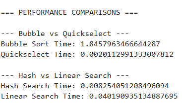

# 📊 Data Structures & Algorithm Performance Analysis System  
**Technical Foundations Project**  
Kevin Turner  
Python | Algorithm Analysis | Performance Benchmarking  

---

## 📌 Project Overview

This project demonstrates foundational computer science principles through the implementation and performance analysis of core data structures and algorithms.

Rather than simply implementing algorithms, this system benchmarks real execution times to analyze scalability and computational efficiency.

The project integrates multiple structures and algorithms into one executable system for comparative analysis.

---

## 🎯 Core Objectives

- Compare inefficient vs optimized sorting behavior  
- Analyze selection algorithm efficiency  
- Benchmark hash table search vs linear search  
- Demonstrate abstract data structure design  
- Validate Big-O complexity behavior with empirical timing  

---

## 🧠 Algorithms & Structures Implemented

- Bubble Sort (O(n²))  
- Quickselect (Average O(n))  
- Hash Table (Average O(1) lookup)  
- Linear Search (O(n))  
- Custom Abstract Data Types (Set, Stack, Queue)  
- Binary Search Tree operations  

---

## ⚡ Performance Benchmark Results

The following benchmark compares algorithm execution time using randomly generated data.

### Screenshot of Execution Results:



---

## 📈 Performance Interpretation

### Bubble Sort vs Quickselect

- Bubble Sort Time: ~1.84 seconds  
- Quickselect Time: ~0.002 seconds  

This represents a performance difference of over **900x faster** for Quickselect under the same data conditions.

This empirically validates theoretical complexity differences:

- Bubble Sort → O(n²)  
- Quickselect → Average O(n)  

---

### Hash Table vs Linear Search

- Hash Search Time: ~0.008 seconds  
- Linear Search Time: ~0.040 seconds  

Hash lookup demonstrates significantly faster access due to average O(1) complexity compared to O(n) linear scanning.

---

## 🔬 Why This Matters

Understanding computational efficiency is critical in:

- Data engineering  
- Analytics pipelines  
- AI system design  
- Large-scale business systems  
- Real-time processing systems  

Poor algorithm selection can increase execution time by orders of magnitude, dramatically affecting scalability and operational performance.

This project demonstrates:

- Applied complexity analysis  
- Empirical benchmarking methodology  
- Performance tradeoff evaluation  
- System-level efficiency reasoning  

---

## 🏗️ System Design Approach

The project integrates:

- Algorithm implementation  
- Controlled benchmarking  
- Runtime measurement using Python timing utilities  
- Structured comparison outputs  
- Interactive menu-driven execution  

This mirrors real-world performance validation workflows used in production engineering environments.

---

## 🚀 Technical Skills Demonstrated

- Algorithm design & analysis  
- Big-O complexity reasoning  
- Performance benchmarking  
- Data structure implementation  
- Hash table collision handling  
- Computational scalability evaluation  
- Technical systems documentation  

---

## 🔮 Future Enhancement Potential

This foundation can be extended into:

- Visualization dashboards (matplotlib / Plotly)  
- Automated benchmarking suites  
- Memory complexity comparison  
- Asymptotic growth modeling  
- Integration with analytics workloads  

---

---

## ▶️ How to Run

1. Clone the repository:

```bash
git clone https://github.com/KevinTurner11/data-structures-algorithm-performance.git
```
2. Navigate into the project folder:
```bash
cd data-structures-algorithm-performance
```
3. Run the project:
If this is a Python script:
```bash
python main.py
```
If this is a Jupyter Notebook:

Open the notebook in Jupyter or VS Code

Run all cells top-to-bottom

4. Optional: Run the interactive menu (if enabled in your code).

## 👤 Author

Kevin Turner  
Management Information Systems & Data Analytics  
SAS Certified | Business Intelligence | AI-Focused Portfolio Development 


